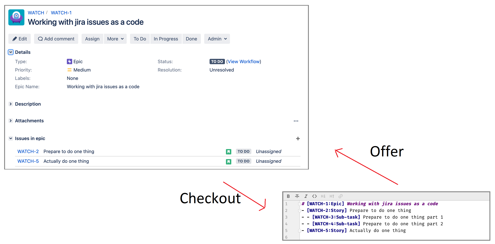

# JAM

**J**ira **a**bstraction with **m**arkdown.



Jira schema in markdown looks like:
```markdown
# [WATCH-1:Epic] Working with jira issues as a code
- [WATCH-2:Story] Prepare to do one thing
- - [WATCH-3:Sub-task] Prepare to do one thing part 1
- - [WATCH-4:Sub-task] Prepare to do one thing part 2
- [WATCH-5:Story] Actually do one thing
```

## How to launch

### With gradle

```bash
./gradlew run --args='checkout WATCH-1 -c=jam-local.properties'
```
where `jam-local.properties` is 
```properties
host = http://localhost:8081
username = admin
password = admin
```

### With binary

```bash
./jam checkout WATCH-1 -c=jam-local.properties
```

If you don't have binary you can build it with `nativeImage` task (tested with GraalVM CE 21.1.0):
```bash
./gradlew nativeImage
```

## Features

### Available

- Schema generation by issue identifier (Stories, Tasks, Epics):
- - Sub-task (maybe not)
- - Story -> Sub-task
- - Epic -> Story -> Sub-task
- Creation of issue
- Changing of issue by identifier (summary, description)

### Not available yet

- Estimation changing
- Linkage
- Type changing
- Parent changing
- Movement

### Will not be implemented for now due rest api restrictions

- Issue deletion - dangerous

## For testing

For some integration tests jira instance is required with default configuration: 
```properties
host = http://localhost:8081
username = admin
password = admin
```
Check `docker-compose-postgres.yml`